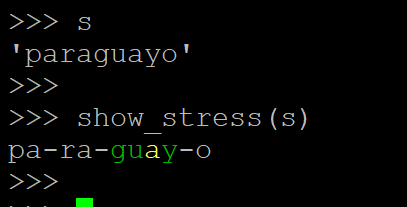
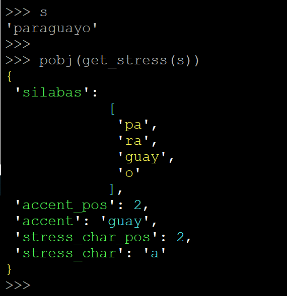

.. contents:: Table of Contents
   :depth: 5

Install
-------
- pip3 install conjugar

Usage
-----

Part0: CLI
==========
    
essila
~~~~~~
- some words include y need special handling,maybe not correct
- get silabas
- essila <word>
    
    ::

        CONJUGAR# essila desayunar
        -----------------------------
        de-sa-yu-nar
        -----------------------------
        {
         'silabas':
                    [
                     'de',
                     'sa',
                     'yu',
                     'nar'
                    ],
         'accent_pos': 3,
         'accent': 'nar',
         'stress_char_pos': 1,
         'stress_char': 'a'
        }
        -----------------------------
        ['de', 'sa', 'yu', 'nar']
        CONJUGAR#

esverb
~~~~~~
- esverb <string-pattern>

    ::
        

        CONJUGAR# esverb yu
        ayunar
        desayunar
        subyugar
        yugular
        yuxtaponer
        ayudar

esconju
~~~~~~~
- in progressing(some special words out of rule)....
- esconju <word> <ip ipi ipps ifi cs sp sfi spi ia>
    
    ::

        CONJUGAR# esconju registrar ip sp

                'ip':'indicativo presente',
                'ipps':'indictivo pretérito perfecto simple',
                'ipa':'indicativo pretérito anterior',
                'ipi':'indicativo pretérito imperfecto',
                'ifi':'indicativo futuro imperfecto',
                'sp':'subjuntivo presente',
                'spi':'subjuntivo pretérito imperfecto',
                'sfi':'subjuntivo futuro imperfecto',
                'cs':'condicional simple',
                'ia':'imperativo afirmativo',

        ip ipi ipps ifi cs sp sfi spi ia
        +++++++++++++++++++++++++++++++++++++++++++++++++++++++++++++
        |         person|                   ip|         sp|prsn_abbr|
        +++++++++++++++++++++++++++++++++++++++++++++++++++++++++++++
        |             yo|             registro|   registre|       s1|
        +++++++++++++++++++++++++++++++++++++++++++++++++++++++++++++
        |         tú/vos|registras / registrás|  registres|       s2|
        +++++++++++++++++++++++++++++++++++++++++++++++++++++++++++++
        |          usted|             registra|   registre|      s23|
        +++++++++++++++++++++++++++++++++++++++++++++++++++++++++++++
        |        él,ella|             registra|   registre|       s3|
        +++++++++++++++++++++++++++++++++++++++++++++++++++++++++++++
        |nostros,nostras|          registramos|registremos|      pl1|
        +++++++++++++++++++++++++++++++++++++++++++++++++++++++++++++
        |vostros,vostras|           registráis| registréis|      pl2|
        +++++++++++++++++++++++++++++++++++++++++++++++++++++++++++++
        |        ustedes|            registran|  registren|     pl23|
        +++++++++++++++++++++++++++++++++++++++++++++++++++++++++++++
        |    ellos,ellas|            registran|  registren|      pl3|
        +++++++++++++++++++++++++++++++++++++++++++++++++++++++++++++

Part1 :acentuacion
==================

    :: 
        
        from conjugar import acentuacion as acen
        from xdict.jprint import pobj,pdir

APIS
~~~~

- show_stress

- get_stress

- get_silabas

    ::
        
        s = 'paraguayo'
        acen.get_silabas(s)
        >>>['pa', 'ra', 'guay', 'o']

- get_accent_pos

    ::

        s = "paraguayo"
        acen.get_accent_pos(s)
        >>>(2,"guay")
        

- get_spans

    ::
        
        spans = acen.get_spans(silabas)
        spans
        >>>>[(0, 2), (2, 4), (4, 8), (8, 9)]

- word2clstarr 
    
    ::
 
        acen.word2clstarr(s)
        >>>['p', 'a', 'r', 'a', 'g', 'uay', 'o']

- AC_A
- AC_E
- AC_I
- AC_O
- AC_U

     ::
     
     >>> acen.AC_A
     'á'
     >>> acen.AC_E
     'é'
     >>> acen.AC_I
     'í'
     >>> acen.AC_O
     'ó'
     >>> acen.AC_U
     'ú'
     >>>        

- CE_C
    
    ::
        
        acen.CE_C
        >>>>'ç'

- DI_U
    
    ::
    
        acen.DI_U
        >>>'ü'

- ENE

    ::
    
        acen.ENE
        >>>'ñ'

- UD_EXCM

    ::
        
        acen.UD_EXCM
        >>>'¡'

- UD_QM
    
    ::
        
         acen.UD_QM
         >>>'¿'        

- ALPHABETA
    
    ::
    
        acen.ALPHABETA
        >>>'abcdefghijklmnopqrstuvwxyzáéíóúñü!¡?¿ç'

- ACUTE_CHARS

    ::
    
        acen.ACUTE_CHARS
        >>>
        'áéíóú'

- ACUTE_CHARS_MIRROR_DICT
    
    ::
    
           pobj(acen.ACUTE_CHARS_MIRROR_DICT)
           >>>
           {
               'a': 'á',
               'e': 'é',
               'i': 'í',
               'o': 'ó',
               'u': 'ú',
               'á': 'a',
               'é': 'e',
               'í': 'i',
               'ó': 'o',
               'ú': 'u'
           }
       

- VOWEL
    
    ::
        
        acen.VOWEL
        >>>['a', 'e', 'i', 'o', 'u', 'á', 'é', 'í', 'ó', 'ú']

- VOWEL_CHARS
    
    ::
        
        acen.VOWEL_CHARS
        >>>'aeiou'

- STRONG_VOWEL_CHARS

    ::
    
         acen.STRONG_VOWEL_CHARS
         >>>'aeo'

- WEAK_VOWEL_CHARS
    
    ::
        
          acen.WEAK_VOWEL_CHARS
'         >>>'iu'
       
- NORMAL_STRONG_VOWEL

    ::
        
        acen.NORMAL_STRONG_VOWEL
        >>>['a', 'e', 'o']

- NORMAL_VOWEL
    
    ::
     
        acen.NORMAL_VOWEL
        >>>['a', 'e', 'i', 'o', 'u']

        
- NORMAL_WEAK_VOWEL

    ::
        
        acen.NORMAL_WEAK_VOWEL
        >>>['i', 'u']

- ACUTE_STRONG_VOWEL

    ::
        
        acen.ACUTE_STRONG_VOWEL
        >>>['á', 'é', 'ó']

- ACUTE_VOWEL

    ::
    
        acen.ACUTE_VOWEL
        >>>['á', 'é', 'í', 'ó', 'ú']

- ACUTE_WEAK_VOWEL
    
      ::
          
          acen.ACUTE_WEAK_VOWEL
          >>>['í', 'ú']

- BI_CONSONANT
    
    ::
    
        acen.BI_CONSONANT
        >>>['ch', 'll', 'rr', 'pl', 'bl', 'tl', 'dl', 'cl', 'gl', 'pr', 'br', 'tr', 'dr', 'cr', 'gr']

- CL_CONSONANT

    ::
    
        acen.CL_CONSONANT
        >>>['pl', 'bl', 'tl', 'dl', 'cl', 'gl', 'pr', 'br', 'tr', 'dr', 'cr', 'gr']

- DI_CONSONANT

    ::
    
        acen.DI_CONSONANT
        >>>['ch', 'll', 'rr']

   
- CONSONANT
    
    ::
        
        acen.CONSONANT
        >>>['b', 'c', 'd', 'f', 'g', 'h', 'j', 'k', 'l', 'm', 'n', 'p', 'q', 'r', 's', 't', 'v', 'w', 'x', 'y', 'z', 'ñ']

- DIPTRONGO

    ::

        acen.DIPTRONGO
        >>>['ai', 'au', 'ei', 'eu', 'oi', 'ou', 'ia', 'ie', 'io', 'ua', 'ue', 'uo', 'iu', 'ui', 'ái', 'áu', 'éi', 'éu', 'ói', 'óu', 'iá', 'uá', 'ié', 'ué', 'ió', 'uó', 'üe', 'üi']

        
- TRIPTONGO
    
    ::
        
        acen.TRIPTONGO
        >>> ['iai', 'iau', 'iei', 'ieu', 'ioi', 'iou', 'iái', 'iáu', 'iéi', 'iéu', 'iói', 'ióu', 'uai', 'uau', 'uei', 'ueu', 'uoi', 'uou', 'uái', 'uáu', 'uéi', 'uéu', 'uói', 'uóu', 'üei', 'üeu']

     

- Y_DIPTRONGO
    
    ::
        
       acen.Y_DIPTRONGO
       >>>['ay', 'ey', 'oy', 'uy', 'áy', 'éy', 'óy', 'üy']
 
- Y_TRIPTONGO
    
    ::
     
       acen.Y_TRIPTONGO
       >>>['iay', 'iey', 'ioy', 'iáy', 'iéy', 'ióy', 'uay', 'uey', 'uoy', 'uáy', 'uéy', 'uóy', 'üey']
        
- Y_LAST
    
    ::
        
        acen.Y_LAST
        >>>['@']
       
- is_vowclst
    
    ::
        
        >>> acen.is_vowclst("a")
        True
        >>> acen.is_vowclst("ai")
        True
        >>> acen.is_vowclst("iai")
        True
        >>> acen.is_vowclst("aa")
        False
        >>> acen.is_vowclst("bi")
        False
        >>>
        
- is_conclst
- is_biconstant
- is_diptrongo
- is_triptongo

- is_acute_char
    
    ::
        
        acen.is_acute_char('a')
        >>>False
        acen.is_acute_char('á')
        >>>True

- to_acute_char
    
    ::

         acen.to_acute_char('a')
         >>>'á'

        
- to_non_acute_char
    
    ::
        
        acen.to_non_acute_char('a')
        >>>'a'

- acute
    
    ::
        
        acen.acute('abcde')
        >>>'ábcdé'

        
- deacute
    
    ::
        
        acen.deacute('ábcdé')
        >>>'ábcdé'

- de_y
    
    ::
 
        s = "paraguayo"
        de_y_rslt = acen.de_y(s)
        de_y_rslt
        >>>['paragu', 'ayo']

- de_trip
- de_dip       
- de_bi
- de_c
- de_v

    
    ::
    
        internal using,  de_y->de_trip->de_dip->de_bi->de_c->de_v
        

- de_engine

    
    ::
    
        internal used by  de_y,de_trip,de_dip,de_bi,de_c,de_v
        

- arr_recvr_lasty
- arr_repl_lasty
- word_recvr_lasty
- word_repl_lasty

- get_stress_charpos_of_silaba
    
    ::
        
        >>> acen.get_stress_char_pos_of_silaba("guay")
        2
        >>> acen.get_stress_char_pos_of_silaba("no")
        1
        >>> acen.get_stress_char_pos_of_silaba("o")
        0
        >>>

- get_charloc
- get_spanloc
- get_spans

- acute_vowel_in

- Help

Part2 :conjugar
================

- In Progressing.....

